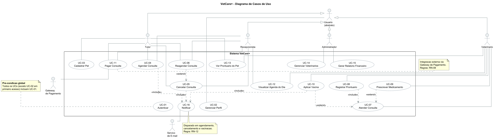
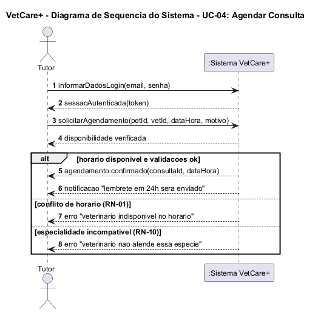
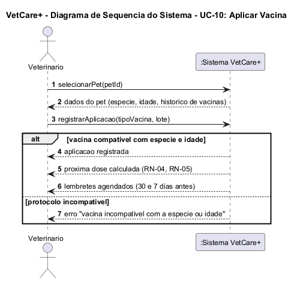
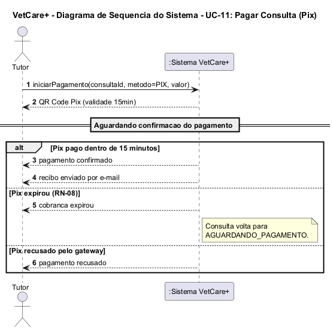
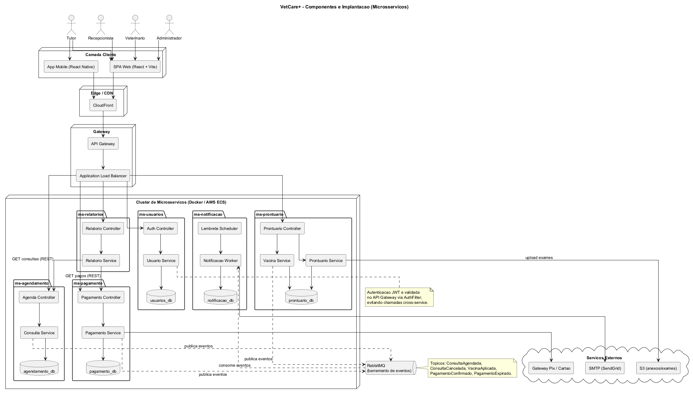
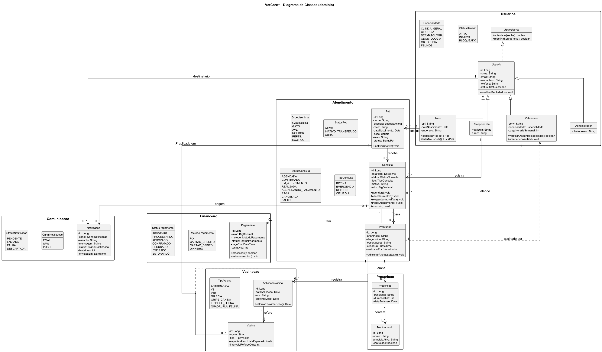
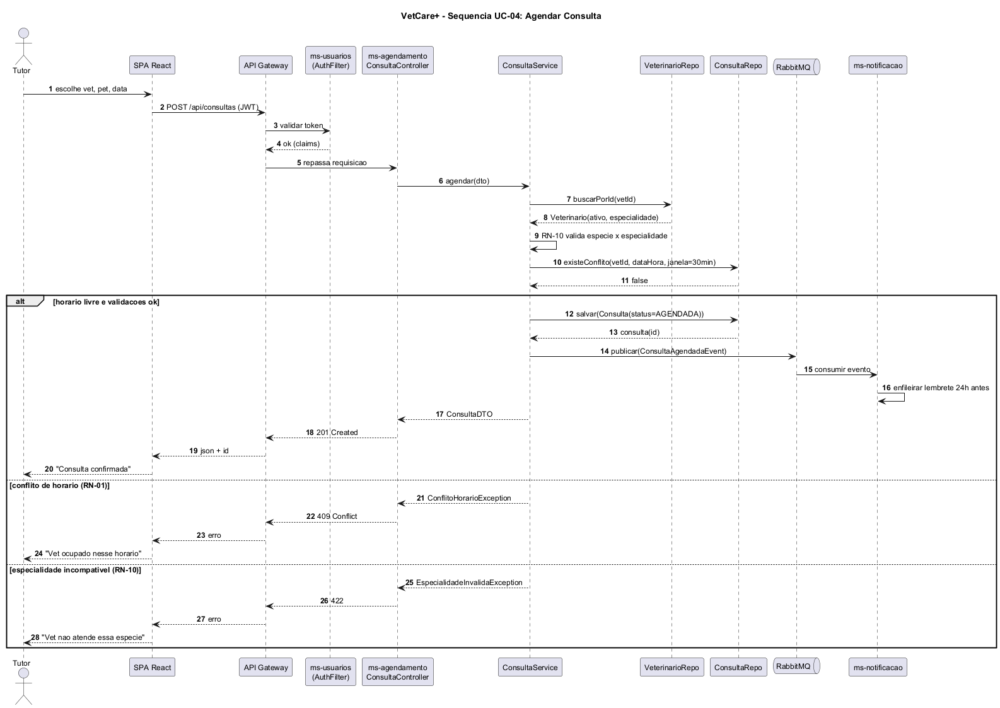
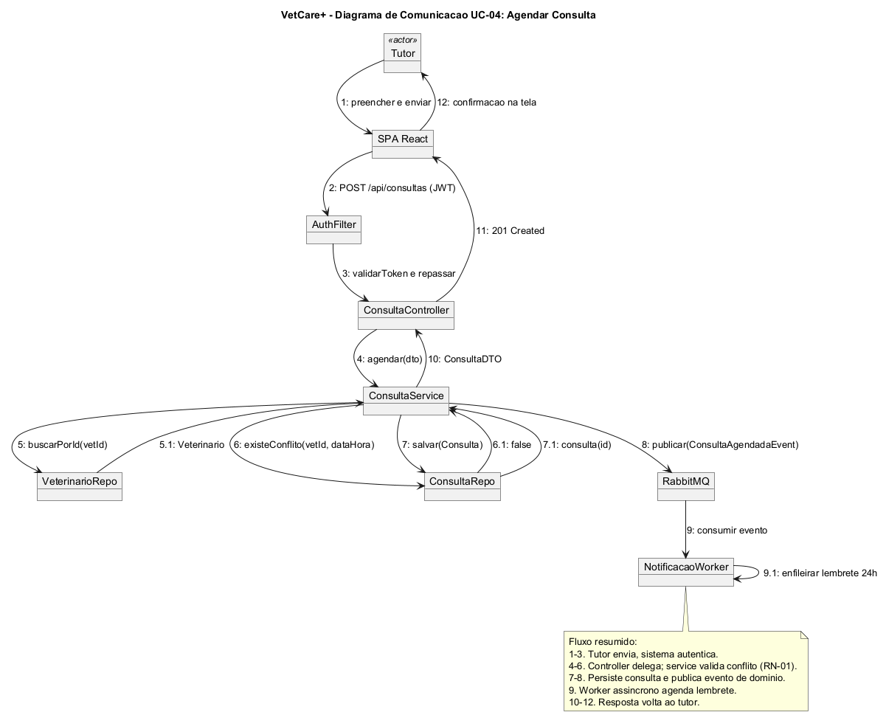
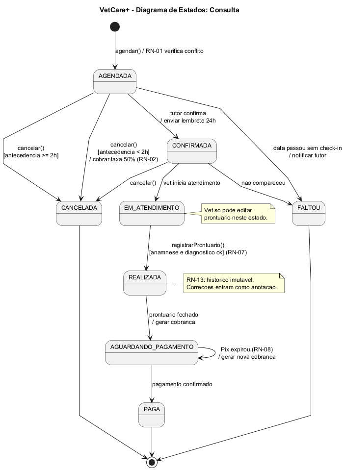
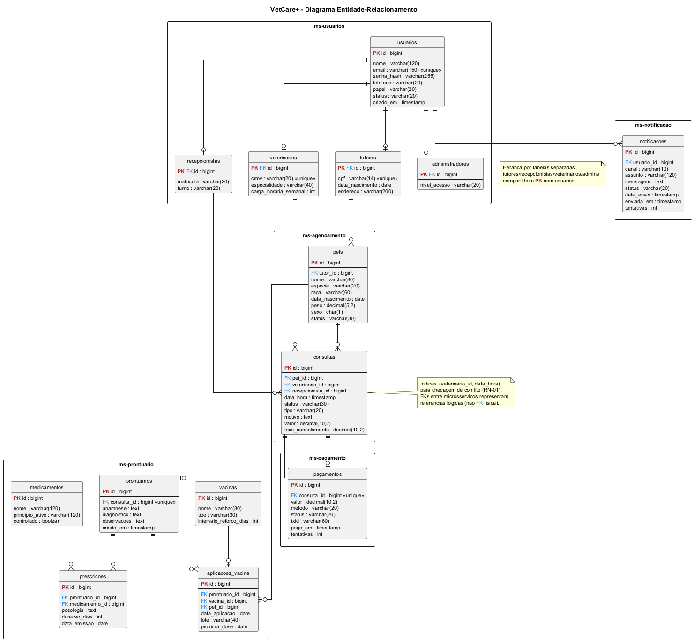

<div style="page-break-after: always;">

<hr style="border: 0; border-top: 4px solid black; margin: 0 0 40px 0;">

<h1 style="font-size: 44px; font-weight: bold; margin: 0;">Documentação de Projeto</h1>

<p style="text-align: right; font-size: 18px; margin-top: 60px;"><b>para o sistema</b></p>

<h1 style="text-align: right; color: #d40000; font-size: 60px; font-weight: bold; margin: 10px 0 60px 0;">VetCare+</h1>

<p style="text-align: right; font-size: 18px; font-weight: bold;">Versão 1.0</p>

<p style="text-align: right; font-size: 14px; margin-top: 40px;">
Projeto de sistema elaborado pelo aluno <b>Luiz F. Moreira</b><br>
como parte da disciplina <b>Projeto de Software</b>.
</p>

<p style="text-align: right; color: #d40000; font-size: 18px; font-weight: bold; margin-top: 60px;">27 de maio de 2026</p>

</div>

<div style="page-break-after: always;">

## Tabela de Conteúdo

| Seção | Página |
|---|---|
| **1. Introdução** | 3 |
| **2. Modelos de Usuário e Requisitos** | 3 |
| &nbsp;&nbsp;&nbsp;&nbsp;2.1 Descrição de Atores | 3 |
| &nbsp;&nbsp;&nbsp;&nbsp;2.2 Modelo de Casos de Uso | 4 |
| &nbsp;&nbsp;&nbsp;&nbsp;2.3 Diagrama de Sequência do Sistema e Contratos de Operações | 5 |
| **3. Modelos de Projeto** | 8 |
| &nbsp;&nbsp;&nbsp;&nbsp;3.1 Arquitetura | 8 |
| &nbsp;&nbsp;&nbsp;&nbsp;3.2 Diagrama de Componentes e Implantação | 9 |
| &nbsp;&nbsp;&nbsp;&nbsp;3.3 Diagrama de Classes | 9 |
| &nbsp;&nbsp;&nbsp;&nbsp;3.4 Diagramas de Sequência | 10 |
| &nbsp;&nbsp;&nbsp;&nbsp;3.5 Diagramas de Comunicação | 10 |
| &nbsp;&nbsp;&nbsp;&nbsp;3.6 Diagramas de Estados | 11 |
| **4. Modelos de Dados** | 11 |
| **Apêndice A — Regras de Negócio** | 13 |
| **Apêndice B — Escopo do MVP e Versões Futuras** | 14 |

## Histórico de Revisões

| Nome | Data | Razões para Mudança | Versão |
|---|---|---|---|
| Luiz F. Moreira | 08/05/2026 | Criação do documento. Esboço inicial dos casos de uso e diagrama de classes. | 0.1 |
| Luiz F. Moreira | 12/05/2026 | Atores externos definidos; enums adicionados ao diagrama de classes. | 0.2 |
| Luiz F. Moreira | 15/05/2026 | Primeiro diagrama de sequência (Agendar Consulta). | 0.3 |
| Luiz F. Moreira | 19/05/2026 | Catálogo de regras de negócio e primeiros contratos de operação. | 0.4 |
| Luiz F. Moreira | 22/05/2026 | Diagramas de estado, sequências adicionais, refatoração para microsserviços. | 0.5 |
| Luiz F. Moreira | 27/05/2026 | Alinhamento ao template oficial. Adição de DSS, capa, contratos em tabela. | 1.0 |

</div>

---

## 1. Introdução

Este documento agrega: 1) a elaboração e revisão de modelos de domínio e 2) modelos de projeto para o sistema **VetCare+**. A referência principal para a descrição geral do problema, domínio e requisitos do sistema é o documento de especificação que descreve a visão de domínio do sistema.

O VetCare+ é um sistema de gestão para clínicas veterinárias. Cuida de agendamento, prontuário do pet, controle de vacinação com lembrete automático, pagamento por Pix ou cartão e relatório financeiro pro administrador.

Quem inspirou o projeto foi minha tia. Ela toca uma clínica de bairro há mais de dez anos e até hoje controla agenda em caderno e ficha de animal em papel. Quando o cliente liga pra remarcar, vira confusão. Quando a vacina antirrábica vence, ninguém avisa e o pet some por meses. No fim do mês ela soma recibo a mão pra saber quanto entrou. Vi isso de perto e quis modelar um sistema que resolvesse esse caos sem ser pesado demais pra uma clínica desse porte.

Aqui não tem código — só modelagem. O que entrego é a arquitetura, os casos de uso, as classes, as sequências, os estados e o modelo de dados. Optei por desenhar em **microsserviços**: pra uma clínica única seria exagero (monolito resolveria), mas o desenho mira numa rede de clínicas — algo do tipo Petz ou Cobasi — em que cada contexto (agendamento, prontuário, pagamento) tem ciclo de mudança próprio.

---

## 2. Modelos de Usuário e Requisitos

### 2.1 Descrição de Atores

Nesta subseção é apresentada a descrição de cada um dos atores que interagem com o sistema VetCare+.

O **Tutor** é o dono do pet. Cria conta com CPF, cadastra um ou mais animais e usa o app pra marcar consulta, ver o histórico (prontuário e vacina), pagar e receber aviso quando o reforço tá perto. Só enxerga os próprios pets.

A **Recepcionista** trabalha no balcão. Faz quase tudo que o tutor faz, só que em nome dele — comum no dia a dia da clínica, quando o cliente liga pedindo pra marcar ou chega sem conta. Registra pagamento presencial e organiza a agenda do dia. Não entra no prontuário em detalhe; isso é território do vet.

O **Veterinário** precisa ter CRMV ativo. Atende a consulta e preenche o prontuário com anamnese, diagnóstico e observações. Também aplica vacina conforme protocolo da espécie, prescreve medicamento e pede exame. Só edita prontuário das consultas que está atendendo no momento (RN-13).

O **Administrador** é o dono ou gerente. Cadastra e desliga vet, define tabela de preço, emite relatório financeiro e mexe nas permissões. É o único que reabre consulta finalizada ou estorna pagamento. Em clínica pequena costuma ser a mesma pessoa do balcão.

**Atores externos:** o **Gateway de Pagamento** (Pix e cartão) processa transações e devolve aprovação por webhook; o **Serviço de E-mail (SMTP)** entrega lembretes e recibos.

### 2.2 Modelo de Casos de Uso

Nesta subseção é apresentado o diagrama de casos de uso do sistema. Cada caso de uso recebe um identificador (UC-01, UC-02 ...) que serve de referência no restante do documento.

O sistema tem 16 UCs. Os marcados como `<<include>>` (UC-01 Autenticar e UC-16 Notificar) entram em todos os fluxos que dependem deles.



**UC-01 — Autenticar.** Verifica e-mail e senha (BCrypt), aplica RN-14 e emite JWT válido por 24h.
**UC-02 — Gerenciar Perfil.** Usuário autenticado atualiza dados e troca senha.
**UC-03 — Cadastrar Pet.** Tutor cadastra pet vinculado ao próprio CPF (RN-03).
**UC-04 — Agendar Consulta.** Tutor (ou recepcionista) reserva horário com um vet. Aplica RN-01 (conflito) e RN-10 (especialidade).
**UC-05 — Cancelar Consulta.** Tutor, recepcionista ou admin cancela uma consulta agendada. Aplica RN-02 (taxa se < 2h).
**UC-06 — Reagendar Consulta.** Mantém o ID original e move pra nova data.
**UC-07 — Atender Consulta.** Vet inicia atendimento, preenche prontuário (UC-08) e pode estender pra UC-09 e UC-10.
**UC-08 — Registrar Prontuário.** Anamnese, diagnóstico e observações. Imutável (RN-13).
**UC-09 — Prescrever Medicamento.** Vet prescreve com posologia e duração. RN-06 valida CRMV.
**UC-10 — Aplicar Vacina.** Vet registra aplicação e lote. Sistema calcula próxima dose (RN-04, RN-05).
**UC-11 — Pagar Consulta.** Tutor paga por Pix ou cartão. RN-08 controla timeout do Pix.
**UC-12 — Visualizar Agenda do Dia.** Vet e recepcionista veem a lista do dia.
**UC-13 — Ver Prontuário do Pet.** Tutor vê o próprio pet; vet vê qualquer pet da clínica.
**UC-14 — Gerenciar Veterinários.** Admin cadastra, ativa ou desliga vet.
**UC-15 — Gerar Relatório Financeiro.** Admin gera relatório mensal (RN-11). Saída em PDF.
**UC-16 — Notificar.** Encapsula envio de e-mail com retry (RN-12).

### 2.3 Diagrama de Sequência do Sistema e Contratos de Operações

Nesta subseção é apresentado o diagrama de sequência do sistema (visão black-box) para três casos de uso e os contratos de operação correspondentes.

#### 2.3.1 DSS — UC-04 Agendar Consulta



#### 2.3.2 DSS — UC-10 Aplicar Vacina



#### 2.3.3 DSS — UC-11 Pagar Consulta



#### Contratos de Operação

| Contrato             | CT-01 |
|----------------------|-------|
| Operação             | `agendarConsulta(tutorId, petId, vetId, dataHora, motivo): ConsultaDTO` |
| Referências cruzadas | UC-04; RN-01; RN-10; RN-15 |
| Pré-condições        | Tutor autenticado; pet pertence ao tutor e está ATIVO; vet está ATIVO; dataHora futura; especialidade compatível com a espécie. |
| Pós-condições        | Consulta persistida com status AGENDADA; evento `ConsultaAgendadaEvent` publicado no RabbitMQ; lembrete agendado para 24h antes. |

| Contrato             | CT-02 |
|----------------------|-------|
| Operação             | `cancelarConsulta(consultaId, motivo, solicitanteId): ResultadoCancelamento` |
| Referências cruzadas | UC-05; RN-02 |
| Pré-condições        | Consulta existe e está em AGENDADA ou CONFIRMADA; solicitante é o tutor dono, recepcionista ou admin; dataHora futura. |
| Pós-condições        | Status atualizado para CANCELADA; se antecedência < 2h, taxa de 50% aplicada; se já paga, estorno disparado; tutor notificado. |

| Contrato             | CT-03 |
|----------------------|-------|
| Operação             | `registrarProntuario(consultaId, vetId, anamnese, diagnostico, obs): ProntuarioDTO` |
| Referências cruzadas | UC-08; RN-07; RN-13 |
| Pré-condições        | Consulta em EM_ATENDIMENTO; vetId é o atendente; anamnese e diagnóstico não vazios. |
| Pós-condições        | Prontuário criado e imutável; consulta passa para REALIZADA; cobrança gerada. |

| Contrato             | CT-04 |
|----------------------|-------|
| Operação             | `prescreverMedicamento(prontuarioId, vetId, medicamentoId, posologia, duracaoDias): PrescricaoDTO` |
| Referências cruzadas | UC-09; RN-06 |
| Pré-condições        | Prontuário existe; vet com CRMV ativo; medicamento cadastrado; duração > 0. |
| Pós-condições        | Prescrição vinculada ao prontuário; se medicamento controlado, registro em log de auditoria. |

| Contrato             | CT-05 |
|----------------------|-------|
| Operação             | `aplicarVacina(prontuarioId, vetId, vacinaTipo, lote): AplicacaoVacinaDTO` |
| Referências cruzadas | UC-10; RN-04; RN-05 |
| Pré-condições        | Prontuário existe; vacina compatível com espécie e idade do pet; lote informado. |
| Pós-condições        | Aplicação registrada; próxima dose calculada por protocolo; lembrete de reforço agendado. |

| Contrato             | CT-06 |
|----------------------|-------|
| Operação             | `pagarConsulta(consultaId, metodo, valor): ResultadoPagamento` |
| Referências cruzadas | UC-11; RN-08 |
| Pré-condições        | Consulta REALIZADA; pagamento ainda não confirmado; valor confere com o valor da consulta. |
| Pós-condições        | Cobrança gerada no gateway; se Pix expirar em 15 min, status volta para EXPIRADO; recibo enviado por e-mail em caso de aprovação. |

| Contrato             | CT-07 |
|----------------------|-------|
| Operação             | `cadastrarPet(tutorId, dados): PetDTO` |
| Referências cruzadas | UC-03; RN-03; RN-09 |
| Pré-condições        | Tutor autenticado; CPF válido; se tutor < 18 anos, responsável legal cadastrado; espécie em lista controlada. |
| Pós-condições        | Pet criado com status ATIVO vinculado ao tutor. |

| Contrato             | CT-08 |
|----------------------|-------|
| Operação             | `autenticar(email, senha): TokenJWT` |
| Referências cruzadas | UC-01; RN-14 |
| Pré-condições        | E-mail cadastrado; conta não BLOQUEADA; senha não expirada. |
| Pós-condições        | Hash BCrypt conferido; JWT emitido com expiração de 24h; após 5 falhas seguidas, conta bloqueada por 15 min. |

| Contrato             | CT-09 |
|----------------------|-------|
| Operação             | `gerarRelatorioFinanceiro(adminId, mesRef, filtros): RelatorioMensalDTO` |
| Referências cruzadas | UC-15; RN-11 |
| Pré-condições        | Solicitante é Administrador; mês de referência ≤ mês atual. |
| Pós-condições        | Dados agregados de pagamentos CONFIRMADO no período; PDF gerado; total bruto, por método e por veterinário disponíveis. |

| Contrato             | CT-10 |
|----------------------|-------|
| Operação             | `enviarLembrete(notificacaoId): ResultadoEnvio` |
| Referências cruzadas | UC-16; RN-12 |
| Pré-condições        | Notificação com status PENDENTE; canal definido; destinatário com e-mail válido. |
| Pós-condições        | E-mail enviado via SMTP; status atualizado para ENVIADA ou FALHA; após 3 tentativas, notificação marcada como DESCARTADA. |

---

## 3. Modelos de Projeto

### 3.1 Arquitetura

A arquitetura do VetCare+ adota o padrão de **microsserviços**. São seis serviços, cada um com seu PostgreSQL. A conversa entre eles passa por RabbitMQ quase sempre — quando algo importante acontece (consulta marcada, vacina aplicada, pagamento confirmado), o serviço publica o evento e quem se importa consome. REST síncrono ficou só onde a resposta faz parte da UX direta: marcar, pagar, atender.

| Serviço          | Responsabilidade |
|------------------|------------------|
| ms-usuarios      | Autenticação JWT, CRUD de perfis (tutor/recepcionista/vet/admin). |
| ms-agendamento   | Consultas, agenda dos vets, regras de conflito de horário. |
| ms-prontuario    | Anamnese, diagnóstico, vacinas, prescrições. Upload de exames pra S3. |
| ms-pagamento     | Integração com gateway Pix/cartão, webhooks, estorno. |
| ms-notificacao   | Worker que consome a fila e dispara e-mail. Scheduler de lembretes. |
| ms-relatorios    | Leitura cruzada de pagamento e agendamento para relatórios. |

Por dentro, mantive a divisão clássica do Spring Boot: controller só recebe HTTP e valida; service segura a regra de negócio (o "não pode marcar dois pets no mesmo horário pro mesmo vet" mora aí); repository é Spring Data JPA puro; DTO separa entidade de contrato de API.

Na borda fica um API Gateway que valida o JWT e roteia via ALB. Front-end React (SPA) e React Native (mobile) entram por CloudFront → API Gateway.

Os padrões adotados foram Repository, Service Layer e DTO no tradicional; Event-Driven via RabbitMQ pra desacoplar serviço de notificação e relatório; Strategy no cálculo de próxima dose de vacina, porque o protocolo muda por tipo (antirrábica é anual, V8/V10 tem ciclo escalonado) — codificar isso em `if` ia ficar feio; e Factory na criação de notificação por canal, prevendo que um dia entra WhatsApp.

**Sobre microsserviços vs monolito.** Pra clínica única isso é overengineering. Reconheço. A justificativa é que o desenho mira numa rede de clínicas — naquele cenário, ter o ms-pagamento isolado (com seu próprio time, seu próprio ciclo de deploy, sua certificação PCI à parte) faz sentido. Se fosse implementar de novo só pra minha tia, faria um monolito modular com os mesmos limites de domínio, e migrava se a hora chegasse.

**Banco por serviço, sem join entre eles.** Quando ms-relatorios precisa cruzar pagamento com agendamento, ou lê dos dois bancos em read-only ou consome eventos e monta sua própria view materializada. Aceitei consistência eventual — relatório pode demorar uns segundos pra refletir um pagamento que acabou de cair.

### 3.2 Diagrama de Componentes e Implantação

Diagrama de componentes do sistema mostrando onde os componentes estarão alocados para execução. Clientes (Web e Mobile) passam por CloudFront e API Gateway, batem no ALB e caem no cluster Docker/ECS onde rodam os seis microsserviços com seus bancos. RabbitMQ orquestra a troca assíncrona. Por fora ficam o gateway de pagamento, o SMTP e o S3 (anexos de exame).



### 3.3 Diagrama de Classes

Diagrama de classes do sistema. O modelo de domínio gira em torno da hierarquia `Usuario` (abstrata) → Tutor, Recepcionista, Veterinario, Administrador. A interface `Autenticavel` define o contrato pra qualquer entidade que precisa logar.

As entidades de negócio são `Pet`, `Consulta` (com o enum `StatusConsulta` cobrindo todo o ciclo de vida dela), `Prontuario`, `Vacina` e a classe associativa `AplicacaoVacina` (que fica entre Pet, Vacina e Prontuário carregando lote e próxima dose), `Prescricao`, `Medicamento`, `Pagamento` e `Notificacao`.



### 3.4 Diagramas de Sequência

Diagramas de sequência para realização dos casos de uso, em visão detalhada (white-box) mostrando as camadas internas de cada microsserviço.

| UC    | Cenário                          | Diagrama |
|-------|----------------------------------|---------|
| UC-04 | Agendar Consulta                 | [UC-04-agendar-consulta.png](../Modelagem/Sequencia/UC-04-agendar-consulta.png) |
| UC-05 | Cancelar Consulta                | [UC-05-cancelar-consulta.png](../Modelagem/Sequencia/UC-05-cancelar-consulta.png) |
| UC-07 | Atender Consulta e Prontuário    | [UC-07-atender-consulta.png](../Modelagem/Sequencia/UC-07-atender-consulta.png) |
| UC-10 | Aplicar Vacina com Reforço       | [UC-10-aplicar-vacina.png](../Modelagem/Sequencia/UC-10-aplicar-vacina.png) |
| UC-11 | Pagar Consulta via Pix           | [UC-11-pagar-consulta.png](../Modelagem/Sequencia/UC-11-pagar-consulta.png) |
| UC-15 | Gerar Relatório Financeiro       | [UC-15-gerar-relatorio.png](../Modelagem/Sequencia/UC-15-gerar-relatorio.png) |
| UC-16 | Job de Envio de Lembrete         | [UC-16-enviar-lembrete.png](../Modelagem/Sequencia/UC-16-enviar-lembrete.png) |

Exemplo (UC-04 Agendar Consulta):



### 3.5 Diagramas de Comunicação

Diagramas de comunicação para realização de casos de uso. Mesma informação que os diagramas de sequência, com foco no quem-chama-quem em vez do quando.

- [Comunicação UC-04 — Agendar Consulta](../Modelagem/Comunicacao/comunicacao-UC04.png)
- [Comunicação UC-10 — Aplicar Vacina](../Modelagem/Comunicacao/comunicacao-UC10.png)
- [Comunicação UC-11 — Pagar Consulta](../Modelagem/Comunicacao/comunicacao-UC11.png)



### 3.6 Diagramas de Estados

Diagramas de estado do sistema, modelando o ciclo de vida das quatro entidades cujos status têm peso de regra de negócio:

- **Consulta** — do agendamento até o pagamento, passando por confirmação, atendimento e realização. [`estado-consulta.png`](../Modelagem/Estado/estado-consulta.png)
- **Vacinação** — pendente → aplicada → vencendo → vencida → reforço aplicado. [`estado-vacinacao.png`](../Modelagem/Estado/estado-vacinacao.png)
- **Pagamento** — pendente → processando → aprovado/recusado/expirado → confirmado/estornado. [`estado-pagamento.png`](../Modelagem/Estado/estado-pagamento.png)
- **Pet** — ativo → inativo (transferido ou óbito). [`estado-pet.png`](../Modelagem/Estado/estado-pet.png)



---

## 4. Modelos de Dados

Esquemas de banco de dados e estratégias de mapeamento entre as representações de objetos e não-objetos.

### 4.1 Tecnologia de Persistência

Cada microsserviço tem o próprio **PostgreSQL 16**, sem compartilhar tabela com vizinho. Acesso por Spring Data JPA + Hibernate. Banco por serviço significa que joins SQL entre serviços não acontecem — relatório que cruza pagamento com agendamento lê dos dois bancos em read-only ou consome eventos via RabbitMQ.

### 4.2 Diagrama Entidade-Relacionamento

São 14 tabelas distribuídas pelos bancos:



| Microsserviço    | Tabelas |
|------------------|---------|
| ms-usuarios      | `usuarios`, `tutores`, `recepcionistas`, `veterinarios`, `administradores` |
| ms-agendamento   | `consultas`, `pets` |
| ms-prontuario    | `prontuarios`, `vacinas`, `aplicacoes_vacina`, `medicamentos`, `prescricoes` |
| ms-pagamento     | `pagamentos` |
| ms-notificacao   | `notificacoes` |

### 4.3 Estratégias de Mapeamento Objeto-Relacional

**Herança da hierarquia Usuario — Table-per-Subclass (JOINED).** A entidade abstrata `Usuario` vira a tabela base `usuarios`, e cada filha (`Tutor`, `Recepcionista`, `Veterinario`, `Administrador`) vira uma tabela própria que **compartilha a chave primária** com `usuarios` via foreign key. Em JPA:

```java
@Entity @Inheritance(strategy = InheritanceType.JOINED)
public abstract class Usuario { ... }

@Entity @PrimaryKeyJoinColumn(name = "id")
public class Tutor extends Usuario { ... }
```

Escolhi essa estratégia em vez de `SINGLE_TABLE` porque os perfis têm atributos bem diferentes entre si (CRMV só faz sentido pra vet, grau de parentesco só pra responsável de tutor menor) e uma tabela única ficaria cheia de coluna nula. Tem o custo de um JOIN a mais em consultas polimórficas, mas em escala de clínica isso é desprezível.

**Classe associativa AplicacaoVacina.** Modelada como entidade própria com surrogate key (id bigint) em vez de chave composta (pet_id + vacina_id + data). Motivo: a mesma combinação pet/vacina/data pode acontecer mais de uma vez (reforço aplicado por mais de um vet por engano, dose perdida e reaplicada) — então chave composta criaria falsos conflitos. Surrogate key é mais simples. As FKs `pet_id`, `vacina_id` e `prontuario_id` ficam como colunas normais com índices.

**Relações 1-1 Consulta-Prontuário e Consulta-Pagamento.** Mapeadas como `@OneToOne` com FK na tabela "filha" (prontuários e pagamentos têm `consulta_id` UNIQUE). Cascade só em CASCADE.PERSIST — se a consulta for apagada (o que praticamente nunca acontece, vira CANCELADA), prontuário e pagamento ficam pra auditoria, mas órfãos.

**Enums como varchar.** `StatusConsulta`, `MetodoPagamento` etc. são gravados como `varchar`, não inteiro. Custa um pouco mais de espaço, mas quando abro o psql pra debugar relatório consigo ler `CONFIRMADO` em vez de `3`. Mapeamento JPA: `@Enumerated(EnumType.STRING)`.

**Referências cross-microsserviço (FKs lógicas).** No DER aparecem setas entre tabelas de microsserviços diferentes (ex.: `consultas.veterinario_id` aponta pra `usuarios.id` que vive em outro banco). **Isso não é FK física no PostgreSQL** — é uma referência lógica mantida pela aplicação. ms-agendamento guarda o `veterinario_id` como bigint, mas não tem constraint declarada. Quem precisa do nome do vet pra exibir faz chamada REST pra ms-usuarios (ou guarda uma cópia desnormalizada do nome no momento do agendamento).

### 4.4 Índices

| Tabela              | Índice                                | Justificativa |
|---------------------|----------------------------------------|---------------|
| usuarios            | `email` (unique)                       | Login |
| veterinarios        | `crmv` (unique)                        | Identificação profissional |
| consultas           | `(veterinario_id, data_hora)`          | Checagem de conflito (RN-01) |
| consultas           | `status`                               | Filtro de agenda do dia |
| pagamentos          | `(status, pago_em)`                    | Relatório financeiro (RN-11) |
| aplicacoes_vacina   | `proxima_dose`                         | Job de lembrete (RN-04) |
| notificacoes        | `(status, data_envio)`                 | Job de envio (RN-12) |

---

## Apêndice A — Regras de Negócio

Catálogo de regras de negócio referenciado pelos casos de uso e contratos.

| ID    | Regra |
|-------|-------|
| RN-01 | Um veterinário não pode ter duas consultas no mesmo horário. Janela mínima entre consultas: 30 minutos. |
| RN-02 | Cancelamento com menos de 2 horas de antecedência gera taxa de 50% do valor da consulta. |
| RN-03 | Pet deve estar vinculado a exatamente 1 tutor responsável, com CPF cadastrado. |
| RN-04 | Vacina antirrábica tem reforço anual obrigatório. Sistema dispara lembrete 30 dias e 7 dias antes do vencimento. |
| RN-05 | Vacinas V8/V10 seguem protocolo: 1ª dose após 45 dias de vida, reforço a cada 21 dias até 4 meses, depois anual. |
| RN-06 | Prescrição de medicamento controlado exige CRMV ativo do veterinário no momento da prescrição. |
| RN-07 | Consulta só passa para REALIZADA depois do prontuário preenchido (anamnese e diagnóstico no mínimo). |
| RN-08 | Pagamento via Pix tem janela de 15 minutos para confirmação. Após isso, a consulta volta para AGUARDANDO_PAGAMENTO. |
| RN-09 | Tutor menor de 18 anos precisa de responsável legal cadastrado (CPF e grau de parentesco). |
| RN-10 | Veterinário só pode atender espécies da sua especialidade declarada, salvo override do administrador. |
| RN-11 | Relatório financeiro mensal consolida pagamentos com status CONFIRMADO entre o 1º e o último dia do mês. |
| RN-12 | E-mail de lembrete tenta envio até 3 vezes em caso de falha. Depois disso, é descartado e admin é notificado. |
| RN-13 | Histórico do prontuário é imutável. Correções entram como nova anotação com referência à anterior. |
| RN-14 | Senha mínima de 8 caracteres com hash BCrypt. Para perfis internos (recepcionista, vet, admin) expira em 90 dias. |
| RN-15 | Pet inativado (óbito ou transferência) não pode ser agendado, mas o histórico permanece consultável. |

---

## Apêndice B — Escopo do MVP e Versões Futuras

### MVP (v1.0 — entrega)

A v1.0 entrega o ciclo completo do dia a dia da clínica: JWT com os quatro perfis, cadastro de tutor e pet, agendamento com cancelamento e reagendamento, atendimento com prontuário, vacina e prescrição, pagamento por Pix e cartão, lembrete por e-mail (24h antes da consulta; 30 e 7 dias antes do vencimento da vacina) e relatório financeiro mensal em PDF.

### v1.1 — Próximo ciclo

Upload de exame complementar (PDF e imagem) pro S3, app mobile do tutor em React Native e notificação push. Coisas que ampliam, mas não mudam o domínio.

### v2.0 — Visão de longo prazo

WhatsApp como canal alternativo de notificação (a RN-12 abre pra isso). Telemedicina veterinária com videoconsulta integrada. Integração com farmácia parceira pra entrega de medicação. Programa de fidelidade.

### Fora de escopo (decisão consciente)

**Estoque de medicamentos** não entrou porque clínica pequena terceiriza a venda — minha tia mesma encaminha pra petshop ao lado. Modelar entrada/saída de estoque ia ser mais sistema do que valor entregue.

**Internação e centro cirúrgico** ficou fora porque é outro domínio: anestesia, escala 24h, monitoramento contínuo. Merece módulo separado e talvez um ms próprio.

**Faturamento por convênio pet** (Petlove Saúde, Pet Vital) ficou de fora porque o mercado ainda é pequeno no perfil de cliente que tenho em mente. Quando ganhar tração, vira tema pra uma v3.

---

*Fim do documento.*
